# Algoritmo operacional do pipeline

## Escopo e fonte de verdade

Este documento descreve o fluxo **implementado** pelo pacote
`openalex_review`. Ele é uma referência operacional complementar ao
[`README.md`](../README.md) e ao [modelo de dados](data-model.md).

O pipeline preserva a proveniência de cada ocorrência recuperada, mas não
substitui o protocolo de revisão, a avaliação humana de relevância, a leitura
integral ou a síntese de evidências.

Entradas versionáveis: código, testes, documentação, YAMLs revisados e
modelos vazios. Produtos de execução são locais e ignorados por Git: YAMLs em
`config/custom/`, JSONL, manifestos, DuckDB, quarentena, exportações,
relatórios, controles preenchidos, PDFs e credenciais.

## Visão completa

```mermaid
flowchart TD
    A[Pesquisador ou automação] --> B[CLI openalex-review<br/>ou painel Streamlit local]
    B --> C[Carrega YAML]
    C --> D[load_search_config]
    D --> E{Estrutura e<br/>valores válidos?}
    E -- não --> E1[Interrompe com erro local<br/>não chama a API]
    E -- sim --> F[Aplica overrides opcionais da CLI<br/>datas, limite, progresso]
    F --> G{Modo da consulta}
    G -- lexical --> H[Works.search expressão]
    G -- semantic --> I[Works.similar descrição]
    I --> J{Há datas ou<br/>has_doi_only?}
    J -- sim --> J1[Interrompe com erro local<br/>filtros semânticos incompatíveis]
    J -- não --> K[Aplica filtros compatíveis]
    H --> K
    K --> L{Comando}
    L -- validate-config --> L1[Exibe consultas validadas]
    L -- count --> M[Consulta count com retentativas]
    M --> M1[Exibe universo filtrado<br/>sem gravar registros]
    L -- collect ou pipeline --> N[Cria manifesto com status running]
    N --> O[Busca OpenAlex via PyAlex<br/>até 5 tentativas por operação]
    O --> P{Busca semântica?}
    P -- sim --> Q[Obtém no máximo 50 registros]
    P -- não --> R[Paginação de até 200 itens<br/>limite conferido item a item]
    Q --> S[Grava JSONL temporário]
    R --> S
    S --> T{Coleta terminou?}
    T -- não --> U[Remove temporário<br/>atualiza manifesto failed com erro e traceback]
    T -- sim --> V[Renomeia JSONL temporário atomicamente]
    V --> W[Calcula SHA-256]
    W --> X[Atualiza manifesto completed<br/>parâmetros, versões, total e hash]
    X --> Y{Comando pipeline?}
    Y -- não --> Z[Produtos brutos locais<br/>prontos para build-db]
    Y -- sim --> AA[build_database]
    AA --> AB[Lê todos os JSONL por padrão ou os run_id selecionados]
    AB --> AC[Normaliza cada linha em works_stage]
    AC --> AD{Linha normalizável?}
    AD -- não --> AE[Registra erro em quarantine<br/>continua a construção]
    AD -- sim --> AF[Insere ocorrência com run_id,<br/>query_id e rank_in_query]
    AE --> AG[Deduplicação]
    AF --> AG
    AG --> AH[Cria works por record_key<br/>maior cited_by_count; empate: data mais recente]
    AH --> AI[Cria work_queries<br/>proveniência distinta]
    AI --> AJ[Cria view works_with_queries<br/>consultas agregadas]
    AJ --> AK[Preserva ou restaura<br/>screening_decisions, reading_status e evidence_notes]
    AK --> AL[CHECKPOINT e substituição atômica<br/>do DuckDB temporário]
    AL --> AM[export_records]
    AM --> AN[Zotero RIS e CSL JSON]
    AM --> AO[ASReview CSV e RIS]
    AM --> AP[Bibliometrix CSV]
    AM --> AQ[works_deduplicated.csv]
    AQ --> AR[generate_report]
    AR --> AS[PRISMA inicial, contagens por consulta,<br/>sobreposição e resumo de triagem]
    AS --> AT[init_control]
    AT --> AU[Modelos vazios de triagem,<br/>leitura e matriz de evidências]
    AO --> AV[Triagem humana no ASReview]
    AV --> AW[import-screening]
    AW --> AX[Resolve obra por record_key,<br/>OpenAlex ID, DOI ou título]
    AX --> AY{CSV íntegro e decisões válidas?}
    AY -- não --> AZ[Cancelamento atômico<br/>arquivo de erros local]
    AY -- sim --> BA[Atualiza DuckDB e CSV de controle]
    BA --> BB[Próximo report mostra inclusão,<br/>exclusão, conflitos e pendências]
```



## Etapas e invariantes

### 1. Configuração e validação

1. A CLI resolve o caminho do YAML em relação à raiz do projeto.
2. `load_search_config` combina `defaults` e cada consulta, valida IDs, modo,
   datas, ordenação e limites.
3. `override_config` aplica apenas overrides temporários de CLI; o YAML não é
   regravado.
4. O modo lexical usa `Works().search(...)`; o semântico usa
   `Works().similar(...)`.
5. Busca semântica é limitada a 50 resultados e não aceita filtros de data nem
   `has_doi`. Essas combinações são rejeitadas no YAML/payload, nos overrides e
   novamente no coletor antes da rede.

O comando `count` mede o universo filtrado no momento da chamada. A contagem
não garante disponibilidade futura e não altera o teto operacional da coleta.

### 2. Coleta rastreável e recuperação de falhas

Para cada consulta, `collect` cria:

```text
data/raw/<run_id>__<query_id>.jsonl
data/manifests/<run_id>__<query_id>.manifest.json
```

O manifesto começa com `status: running`. A coleta grava primeiro um arquivo
temporário; somente depois do sucesso ele substitui o JSONL final. O manifesto
concluído inclui consulta e filtros efetivos, versões de software, horário,
quantidade gravada e SHA-256. Em erro, o temporário é removido e o manifesto
registra `status: failed`, tipo, mensagem e traceback.

Operações de API recebem até cinco tentativas. Entre falhas, a espera é:

```text
min(60 segundos, 2^tentativa + valor aleatório)
```

Para lexical, a paginação pode receber 200 itens por página, mas o código para
antes de exceder `max_records`. Para semântica, a chamada usa `get` e aplica o
limite mínimo entre `max_records` e 50.

### 3. Normalização, quarentena e deduplicação

`build-db` lê todos os JSONL presentes em `data/raw/` por padrão, preservando o
comportamento cumulativo anterior. Para selecionar composição explicitamente,
repita `--run-id`; por exemplo, `openalex-review build-db --run-id rodada1
--run-id rodada2`. Cada linha válida dos arquivos selecionados é normalizada e inserida em `works_stage` com
`run_id`, `query_id` e posição na consulta. Uma falha de normalização vai para
`data/quarantine/normalization_errors.jsonl`; as demais linhas continuam sendo
processadas.

`record_key` prioriza o identificador OpenAlex. A tabela `works` mantém uma
linha por chave e escolhe a ocorrência com maior número de citações; em empate,
a de data de publicação mais recente. `work_queries` preserva todas as origens
distintas e `works_with_queries` agrega os IDs de consulta para exportação e
auditoria.

O comando grava `database_build_manifest` no DuckDB, com os `run_id` escolhidos,
caminhos e SHA-256 de cada JSONL e manifesto. Cada entrada bruta precisa ter
manifesto `completed` correspondente; ausência, incompatibilidade ou rodada
solicitada sem arquivo interrompe a construção. Os manifestos continuam sendo a
evidência de origem metodológica.

### 4. Banco, exportações e relatórios

O DuckDB é construído em arquivo temporário. Antes da substituição, o processo
salva e restaura linhas já existentes de `screening_decisions`,
`reading_status` e `evidence_notes`. Após `CHECKPOINT`, o banco temporário é
movido para `data/db/openalex.duckdb`.

`export` lê `works_with_queries` e gera produtos deduplicados para Zotero,
ASReview, Bibliometrix e CSV local. `report` produz as contagens de
identificação/deduplicação, resultados por consulta, sobreposição e o resumo de
triagem. O PRISMA implementado cobre identificação, deduplicação e triagem
inicial; texto integral e síntese final dependem de etapas posteriores.

### 5. Triagem humana

O CSV exportado pelo ASReview retorna ao pipeline por `import-screening`. O
importador reconhece colunas de decisão usuais, converte valores para
`incluir`/`excluir` e resolve cada registro por `record_key`, OpenAlex ID, DOI
ou título. Se houver registro desconhecido ou decisão inválida, a importação é
cancelada para evitar estado parcial. Importações repetidas são idempotentes por
revisor e etapa, salvo uso explícito de `--replace`.

Os códigos são centralizados em `screening_vocabulary.py`: etapas
`titulo_resumo`/`texto_integral`, decisões `incluir`/`excluir` e motivos de
exclusão controlados. O CSV pode fornecer etapa e motivo por linha (colunas
`stage`/`etapa` e `exclusion_reason`/`motivo_exclusao`, ou via opções da CLI).
Inclusões não exigem motivo; exclusões em `texto_integral` exigem código
controlado. Valores desconhecidos cancelam o lote inteiro antes de gravar no
DuckDB ou substituir o CSV de controle. O código do motivo fica em
`motivo_exclusao`, sua descrição humana em `descricao_motivo` e notas livres em
`observacoes`. Dados históricos não são convertidos automaticamente.

## Limites operacionais importantes

- Um teto de coleta é um limite de execução, não demonstra cobertura exaustiva.
- A ordenação e a disponibilidade da OpenAlex podem variar com o tempo.
- A deduplicação atual é centrada em `record_key`; versões diferentes ou
  registros OpenAlex distintos do mesmo trabalho podem requerer auditoria
  humana.
- Rodadas com a mesma pergunta, protocolo, critérios e estratégia compatível
  podem ser combinadas quando a atualização/replicação ou ampliação planejada da
  busca fizer parte do protocolo; use todos os `--run-id` pretendidos e registre
  a justificativa.
- É metodologicamente inválido combinar no mesmo corpus rodadas com perguntas,
  critérios de elegibilidade, estratégias ou fases incompatíveis como se fossem
  uma única busca. Selecione apenas as rodadas aprovadas ou mantenha raízes de
  projeto separadas.
- A composição do corpus é decisão do pesquisador responsável e da equipe da
  revisão, conforme protocolo aprovado; a ferramenta não decide compatibilidade.
- A presença em uma exportação não equivale a inclusão na revisão; a inclusão
  depende de critérios e triagem humana documentados.